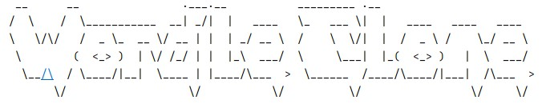
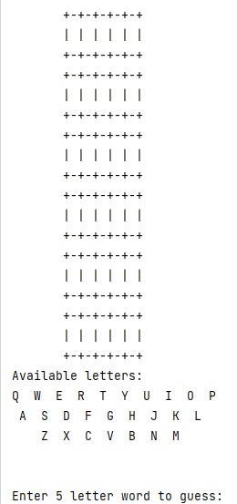
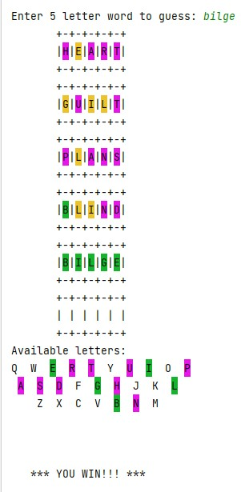

# Wordle Clone

This clone of the popular game Wordle was used as a learning challenge to practice using Java Object Oriented Programming.  This was written duing my spare time while working through the Tech Elevator coding bootcamp.  At this phase, we had not learned front end skills yet, so this program was done using the command line interface with ASCII art.

## Programming Notes

The program revolves around a class that was created to hold each letter while holding properties such as a character, color code, and location in the answer.  These letters could then be organized into Lists<Letter> to make words with individual properties.  The Letter objects in the pool of letters to create a guess are kept different from the Letters in past guesses to allow for the correct color coding scheme.  This set up would allow variations to flex to words of alternates lengths if desired with no change in the logic.
  
The list of words is read in from a txt file which is fairly limited at this point.  A random word is chosen from this list and each guess must exist on the list to be a valid guess.

  
  ## Future Updates
  
  When I'm more comfortable with front end, I plan to revist this project and swap out the CLI for a web interface.  The backend list of words needs to be updated to a more robust system with the ability to load more words, possible from an API.  This would also make it fairly simple to swap word lists at runtime to flip between other Wordle flavors that have become popular like Bardle (Shakespearean).
  
  Thank you for visiting!
  Colin
